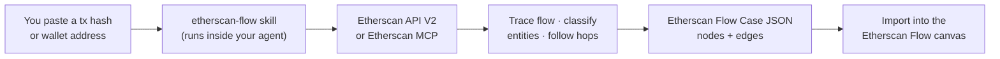
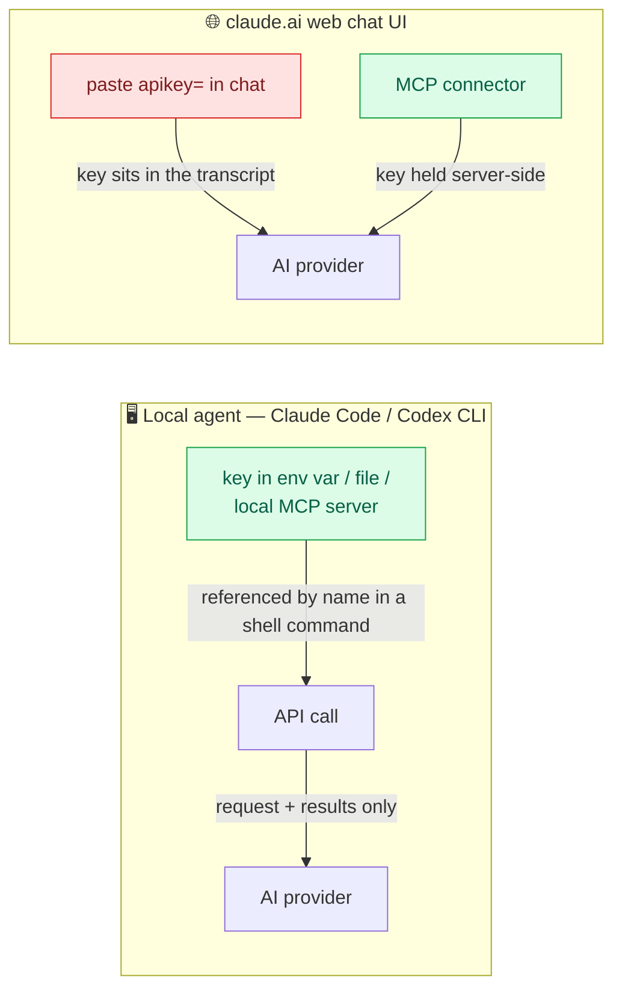

# Etherscan Flow — Agent Skill

[](./LICENSE)

An installable [Agent Skill](https://docs.claude.com/en/docs/agents-and-tools/agent-skills/overview) that maps **any** on-chain money flow. Give it a **transaction hash** or a **wallet address**, and it calls the **Etherscan API V2** to trace the flow and write a single **Etherscan Flow Case** JSON (`nodes` + `edges`) you can import straight into the [Etherscan Flow](https://etherscan.io) canvas.

Use it for a plain transfer, a token launch, a DeFi swap route, an NFT mint — or a full scam/hack investigation (victim → attacker → laundering hops → CEX deposit).

Output is **JSON only** — every node and edge is grounded in a real API response, never invented.

## How it works



Supported chains: **Ethereum** (default), BNB Chain, Polygon, Arbitrum, Optimism, Base, Avalanche, Fantom.

## Quick start

Pick your tool. Steps are given for **macOS**, **Linux**, and **Windows**.

<details open>
<summary><b>Claude Code (CLI)</b></summary>

Clone into your personal skills folder, then invoke `/etherscan-flow`.

**macOS / Linux**
```bash
git clone https://github.com/homeyong/etherscan-flow.git ~/.claude/skills/etherscan-flow
```

**Windows (PowerShell)**
```powershell
git clone https://github.com/homeyong/etherscan-flow.git "$env:USERPROFILE\.claude\skills\etherscan-flow"
```

Then in Claude Code: `/etherscan-flow trace this scam 0x…`
</details>

<details>
<summary><b>Codex CLI</b></summary>

Codex has no dedicated skills folder yet, so you load the skill as context.

**macOS / Linux / Windows**
```bash
git clone https://github.com/homeyong/etherscan-flow.git
```

Then either add one line to your project's `AGENTS.md`:
```
For any on-chain tracing request, follow ./etherscan-flow/SKILL.md exactly.
```
…or paste the contents of `SKILL.md` at the start of a Codex session.
</details>

<details>
<summary><b>Claude.ai — the web chat UI</b></summary>

> **Note:** "Claude.ai" here means the **web chat interface** at [claude.ai](https://claude.ai), *not* the Claude Code CLI.

1. Download this repo as a ZIP (green **Code** button → **Download ZIP**).
2. Go to **claude.ai/customize/skills** and upload it.
3. On paid plans, allowlist `api.etherscan.io` in the skill's network settings so it can reach the API.

⚠️ On the web UI you can only supply a key by **pasting it in chat** or via a **connector** — see the note below on what that means for privacy.
</details>

## Your Etherscan API key — and how private it really is

An Etherscan key is read-only and rate-limited, so leaking one is low-stakes — but keep it out of the chat transcript where you reasonably can. The skill picks a key source in this order, first match wins:

**inline `apikey=` → Etherscan MCP → `ETHERSCAN_API_KEY` env var → local key file → demo key**

**Where the key actually goes depends on where you run it:**



| Where you run it | How you give the key | Does the key value reach the AI provider? |
|---|---|---|
| **Claude Code / Codex** (local) | env var, local file, or local MCP | **No** — a shell command references it by name; the model only sees the request and the API results |
| **Any tool** | inline `apikey=…` | **Yes** — it's in the chat. Use a throwaway free-tier key |
| **claude.ai web** | MCP / connector | **No** — the connector holds it server-side |
| **claude.ai web** | inline `apikey=…` | **Yes** — it's in the transcript |

**Be honest with yourself about the boundary:** the local paths keep the *secret key* off the wire — but they do **not** make the investigation private. The addresses, hashes, and Etherscan responses still travel through your AI provider (Anthropic / OpenAI) as normal model context, exactly like any other prompt. So the guarantee is *"your key stays on your machine,"* not *"nothing leaves your machine."* Full local privacy would require running a local model too, which is out of scope here.

Get a free key at [etherscan.io/apis](https://etherscan.io/apis).

## Usage

Paste a hash or address and ask to investigate:

```
trace this scam 0x<txhash>
follow the money from this victim wallet 0x<address>
this is the scammer address 0x<address>, find the victims
build a case for this hack 0x<address> apikey=YOUR_KEY
```

You get a JSON file. Open [Etherscan Flow](https://etherscan.io), choose **Import**, and paste it — the schema maps one-to-one, no reformatting.

## Output schema

```json
{
  "id": "case-a1b2c3d4",
  "name": "0xabcd… — approval drain traced to Binance 14",
  "schemaVersion": 1,
  "nodes": [ { "id": "victim01", "address": "0x…", "role": "victim_wallet", "hop": 0, "label": "Victim", "notes": "…" } ],
  "edges": [ { "id": "e1", "source": "victim01", "target": "atk01", "amount": "5000", "token": "USDT", "type": "token_transfer", "txhash": "0x…" } ],
  "_meta": { "chain": "ethereum", "patterns": [], "gaps": [], "disclaimer": "…" }
}
```

Roles, labels, and notes are AI inference over public Etherscan data — **not** Etherscan verdicts, accusations, or legal findings.

## Tool coverage

| Tool | v1 |
|---|---|
| Claude Code | ✅ |
| Codex CLI | ✅ |
| Claude.ai (web) | ✅ |
| Gemini CLI, others | later — [open an issue](https://github.com/homeyong/etherscan-flow/issues) if you want one |

Coverage grows with demand — tell us what you use.

## License

[MIT](./LICENSE)
